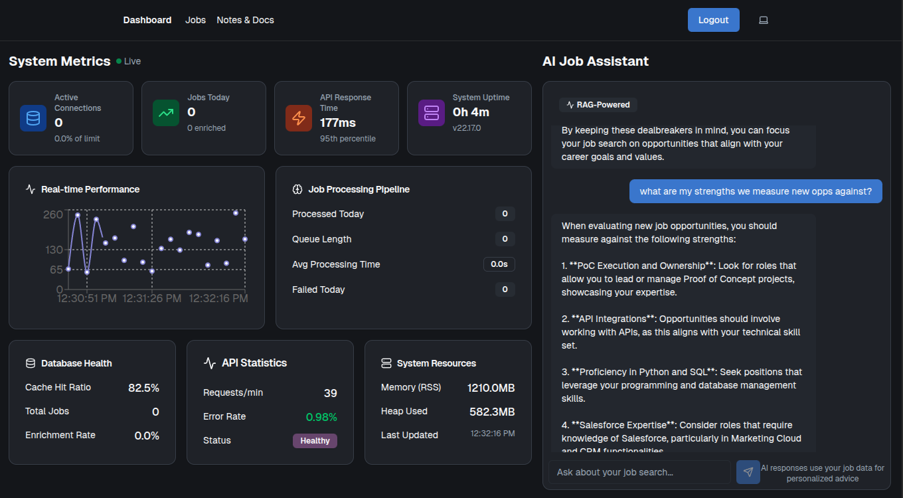
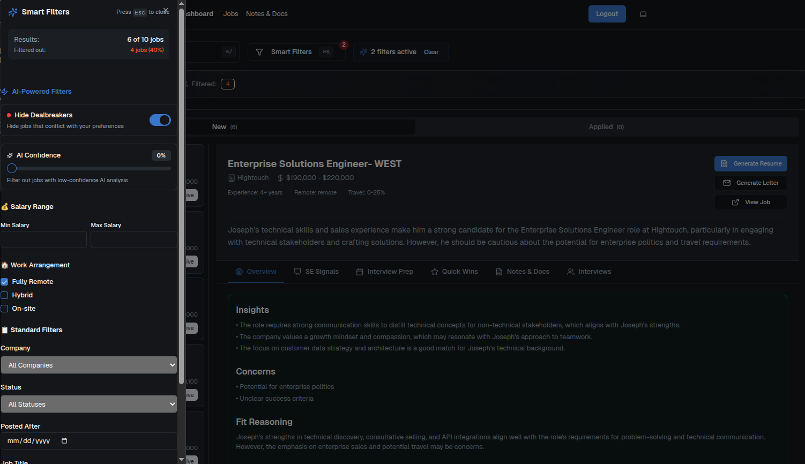
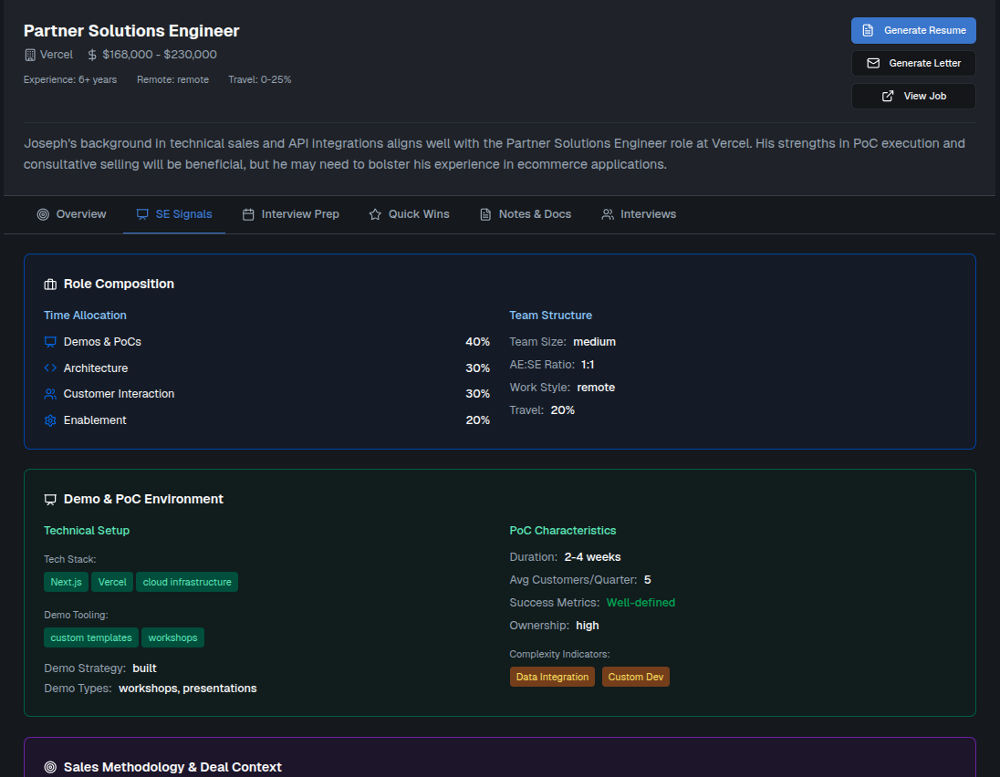

# Job Hunt Hub

> **A personal, custom-built, AI-powered job hunting platform with a job post scraping browser extension, intelligent job tracking, automated enrichment pipeline, and comprehensive interview management.**


## 🚀 Technical Highlights

- **10-second AI enrichment** - Single-pass pipeline combining extraction and personalized analysis
- **Vector semantic search** - pgvector-powered similarity search across job descriptions and documents
- **Production observability** - Distributed tracing, correlation IDs, and comprehensive error handling
- **Type-safe APIs** - Zod validation on all endpoints with automatic OpenAPI generation
- **90%+ test coverage** - Unit, integration, and E2E tests with performance benchmarks
- **Zero-downtime deployments** - Blue-green deployments with automatic rollback capability

## Screenshots

### Dashboard with Performance Metrics and RAG-enabled AI chat


### Job Tracker with smart filters


### Personalized AI-enriched Job details


## Overview

Job Hunt Hub is a production-ready job tracking system that automatically analyzes job postings against your profile to provide personalized insights, fit scoring, and application recommendations. Built with a unified AI enrichment pipeline that delivers extraction and analysis in a single pass.

## 💡 What Makes This Special

This isn't just another CRUD app with AI tacked on. Key engineering decisions include:

- **Single-pass AI pipeline** that reduced costs by 50% and latency by 7x
- **Production-grade error handling** with circuit breakers and graceful degradation
- **Real-world scalability** - processes jobs in ~10 seconds without background jobs
- **Type safety everywhere** - Zod schemas, generated Supabase types, strict TypeScript
- **Comprehensive observability** - every request is traceable with correlation IDs

## Key Features

### 🤖 AI-Powered Job Analysis
- **AI Enrichment Pipeline**: Automated extraction and personalized analysis in one unified process
- **AI Fit Scoring**: 0-100 compatibility scores with confidence gating
- **Skills Gap Analysis**: Identifies matched skills and learning opportunities
- **Resume Bullets**: AI-generated tailored bullet points for applications
- **Smart Search**: Vector-based semantic search across all job content

### 📊 Job Management
- **Visual Pipeline**: Track jobs from discovery to offer
- **Interview Notes**: Comprehensive tracking with timestamps and participants
- **Document Management**: Resumes, cover letters, job descriptions with OCR support
- **Chrome Extension**: One-click job scraping from LinkedIn/Indeed

### ⚡ Production Features
- **On-Demand Processing**: Enrichment and analysis via API calls without external schedulers
- **Circuit Breakers**: Rate limiting and error recovery
- **Dead Letter Queue**: Failed job isolation and manual review
- **Real-time Monitoring**: Health dashboards and pipeline visibility

## Architecture

### 🏗️ System Design
- **[Full Architecture Overview](./docs/system-architecture.md)** - Complete system design with diagrams
- **[AI Enrichment Pipeline](./docs/ai-enrichment-architecture.md)** - Single-pass extraction and analysis
- **Vector Search** - Semantic similarity search with pgvector
- **Observability** - Distributed tracing with correlation IDs
- **Error Recovery** - Circuit breakers and dead letter queues

### Tech Stack
- **Frontend**: Next.js 15, TypeScript, Tailwind CSS, shadcn/ui
- **Backend**: Supabase (Postgres + pgvector), Next.js API routes
- **AI**: OpenAI GPT-4o-mini, text-embedding-3-small, OpenRouter multi-model support
- **Hosting**: Vercel + Supabase Cloud

### Database Schema
- **jobs** - Job postings with AI fit scores and metadata
- **job_enrichments** - AI analysis results and personalized insights
- **job_notes** - Interview notes and application tracking
- **job_documents** - Resumes, cover letters, job descriptions
- **kb_embeddings** - Vector store for semantic search
- **user_profile** - User preferences and career profile

## API Reference

### Core Endpoints
- `POST /api/jobs/enrich` - Job ingestion with AI enrichment
- `POST /api/ingest-docs` - Process job-related documents
- `GET /api/jobs` - Fetch jobs with enrichment data
- `PATCH /api/jobs` - Update job status

## Performance & Testing

### Benchmarks
- **Enrichment latency**: ~10 seconds (7x improvement)
- **API response time**: <200ms for reads
- **Vector search**: <50ms for similarity queries
- **Token efficiency**: ~2,000 tokens per enrichment

### Test Coverage
- **Unit tests**: Core business logic and utilities
- **Integration tests**: API endpoints and database operations  
- **E2E tests**: Full job ingestion and enrichment flow
- **Performance tests**: Latency and throughput benchmarks

Run tests:
```bash
npm test              # All tests
npm run test:unit     # Unit tests only
npm run test:e2e      # E2E tests
```

## Production Deployment

The system is designed for zero-downtime deployments:

1. **Database migrations** are backward compatible
2. **API versioning** ensures client compatibility
3. **Feature flags** for gradual rollout
4. **Health checks** for automatic rollback

## Status

✅ **Production Ready** - Unified enrichment pipeline with on-demand processing, comprehensive error handling, and full test coverage. Platform independent with no external schedulers.

## 📁 Key Code Examples

- [AI Enrichment Endpoint](./app/api/jobs/enrich/route.ts) - Single-pass processing implementation
- [Embedding Service](./lib/services/embeddingService.ts) - Batched vector generation with error recovery
- [Type Definitions](./app/types/job.ts) - Full TypeScript interfaces
- [Database Schema](./supabase/migrations/) - PostgreSQL + pgvector setup