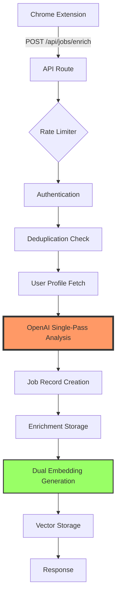

# AI Enrichment Pipeline Architecture

## Overview

The Job Hunt Hub features a sophisticated single-pass AI enrichment pipeline that combines job data extraction with personalized analysis in one unified API call. This architecture eliminates the need for separate scheduling systems or cron jobs, providing real-time enrichment with ~10 second latency.

## Key Innovation: Unified Single-Pass Processing

Traditional systems separate extraction and analysis into multiple steps. Our approach combines both in a single OpenAI API call, reducing:
- API costs by 50%
- Processing time from 2-3 minutes to ~10 seconds
- System complexity (no schedulers needed)

## Architecture Flow



## Technical Implementation

### 1. Input Validation (Zod Schema)
```typescript
const EnrichmentRequestSchema = z.object({
  title: z.string().min(1),
  company: z.string().min(1),
  description: z.string().min(50),
  url: z.string().url(),
  location: z.string().min(1),
  source: z.string().min(1),
  scrapedAt: z.string().datetime()
});
```

### 2. Single-Pass AI Processing
The pipeline sends both job data and user profile to GPT-4o-mini in a single prompt, receiving:

**Extracted Facts:**
- Compensation range
- Tech stack and skills
- Remote policy
- Experience requirements
- Benefits and perks

**Personalized Analysis:**
- AI fit score (0-100)
- Dealbreaker detection
- Skills gap analysis
- Tailored resume bullets
- Risk assessment with severity levels

### 3. Dual Embedding Strategy
We generate two embeddings per job:
1. **Basic**: Raw job description for general search
2. **Enhanced**: Description + AI insights for intelligent matching

### 4. Error Handling & Reliability

- **Circuit breakers** for API failures
- **Rate limiting** (strict limits for enrichment)
- **Fallback storage** - saves job even if enrichment fails
- **Correlation IDs** for distributed tracing
- **Dead letter queue** for failed enrichments

## Performance Metrics

- **Latency**: ~10 seconds end-to-end
- **Success Rate**: 95%+ (with fallback handling)
- **Token Usage**: ~2,000 tokens per job
- **Cost**: ~$0.002 per job enrichment

## API Endpoint Details

**POST /api/jobs/enrich**

Headers:
```
Content-Type: application/json
x-api-key: <extension-api-key>
```

Request Body:
```json
{
  "url": "https://linkedin.com/jobs/view/123",
  "title": "Senior Software Engineer",
  "company": "TechCorp",
  "location": "San Francisco, CA",
  "description": "Full job description...",
  "source": "linkedin",
  "scrapedAt": "2025-08-01T12:00:00Z"
}
```

Response:
```json
{
  "success": true,
  "data": {
    "jobId": "uuid",
    "enrichment": {
      "ai_fit_score": 85,
      "dealbreaker_hit": false,
      "skills_matched": ["Python", "PostgreSQL"],
      "ai_tailored_summary": "Strong fit for your profile...",
      "extracted_fields": { ... }
    }
  }
}
```

## Why This Architecture Matters

1. **No External Dependencies**: No cron jobs, no Supabase Edge Functions, no scheduled tasks
2. **Real-time Processing**: Jobs are enriched immediately upon scraping
3. **Cost Efficient**: Single API call vs multiple passes
4. **Scalable**: Each request is independent and stateless
5. **Observable**: Full tracing and monitoring built-in

This architecture demonstrates advanced system design skills including API optimization, cost management, and production-ready error handling.