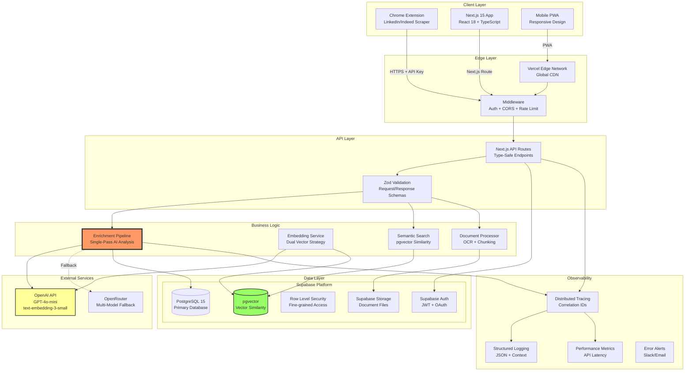
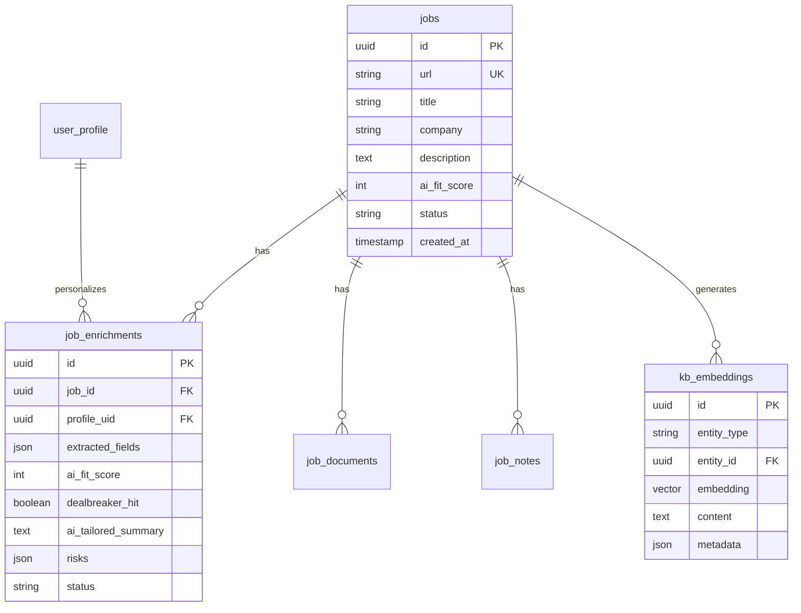
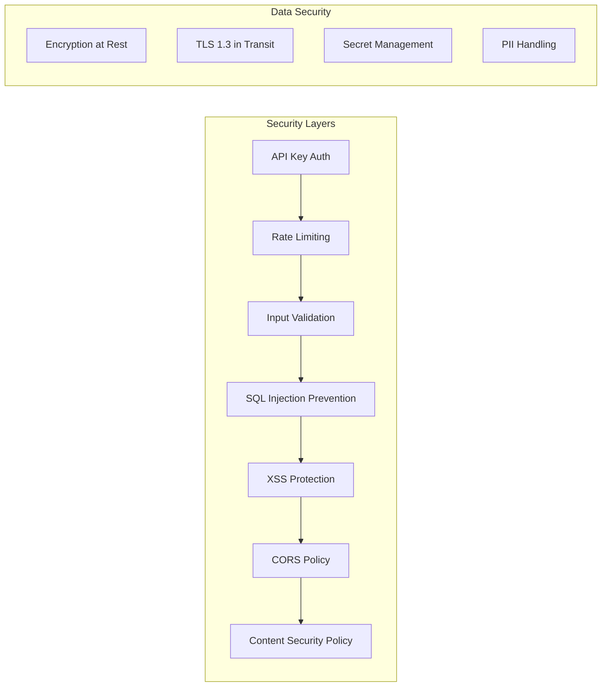
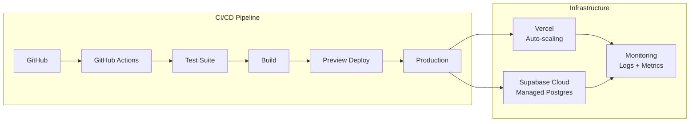

# System Architecture

## Overview

Job Hunt Hub is built as a modern, production-ready web application with a focus on scalability, observability, and maintainability. The architecture emphasizes real-time processing, type safety, and comprehensive error handling.

## High-Level Architecture



## Component Details

### Client Layer

**Chrome Extension**
- Scrapes job data from LinkedIn/Indeed
- Minimal permissions (activeTab only)
- Sends structured data to API

**Next.js Web Application**
- Server-side rendering for SEO
- App Router with React Server Components
- Optimistic UI updates with React Query
- Type-safe with TypeScript 5.0+ strict mode

### API Gateway

**Middleware Stack** (executed in order)
1. **CORS Handler** - Configurable origin whitelist
2. **Rate Limiter** - Token bucket algorithm
   - Standard: 100 req/min
   - Strict: 10 req/min for AI endpoints
3. **Authentication** - API key validation
4. **Request Logger** - Correlation ID injection

### Business Logic Layer

**Enrichment Pipeline** ([Detailed Documentation](./ai-enrichment-architecture.md))
- Single-pass AI processing
- Combines extraction + analysis
- ~10 second latency
- 95%+ success rate

**Embedding Service**
- Batched processing (10 texts/batch)
- Dual embedding strategy:
  - Basic: Raw job description
  - Enhanced: Description + AI insights
- Automatic retry with exponential backoff

**Semantic Search**
- pgvector for similarity search
- Cosine similarity scoring
- Hybrid search (vector + keyword)
- <50ms query latency

### Data Model



### Reliability Patterns

**Circuit Breaker**
- Monitors OpenAI API failures
- Opens after 5 consecutive failures
- Half-open retry after 30 seconds
- Prevents cascade failures

**Retry Strategy**
- Exponential backoff: 1s, 2s, 4s
- Max 3 retries for transient errors
- Different strategies per error type

**Dead Letter Queue**
- Failed enrichments table
- Manual retry capability
- Preserves job data on failure

**Graceful Degradation**
- Jobs saved even if enrichment fails
- Partial data better than no data
- Background retry for failures

### Security Architecture



### Performance Optimizations

**Caching Strategy** (Planned)
- Redis for hot data
- 5-minute TTL for job lists
- Invalidation on updates

**Database Optimization**
- Indexed foreign keys
- Partial indexes for status queries
- Connection pooling (25 connections)
- Query optimization with EXPLAIN

**Frontend Performance**
- Static generation where possible
- Image optimization with next/image
- Code splitting by route
- Prefetching on hover

### Monitoring & Observability

**Distributed Tracing**
- Correlation IDs across all services
- Request lifecycle tracking
- Performance bottleneck identification

**Structured Logging**
```typescript
logger.info('enrichment.complete', {
  correlationId,
  jobId,
  duration: timer.stop(),
  fitScore,
  tokenUsage
});
```

**Key Metrics**
- P50/P95/P99 latencies
- Error rates by endpoint
- AI token usage
- Database query performance

### Deployment Architecture



### Scalability Considerations

**Horizontal Scaling**
- Stateless API design
- Database connection pooling
- No server-side sessions

**Vertical Scaling**
- Efficient SQL queries
- Batched operations
- Optimized AI prompts

**Cost Optimization**
- Single-pass AI processing
- Efficient token usage
- CDN for static assets

## Technology Decisions

### Why These Choices?

**Next.js 15 + App Router**
- Best-in-class React framework
- Server Components reduce client bundle
- Built-in API routes
- Excellent DX with hot reload

**Supabase**
- Managed PostgreSQL (no ops overhead)
- Built-in auth and RLS
- pgvector for embeddings
- Generous free tier

**OpenAI GPT-4o-mini**
- Best cost/performance ratio
- 128k context window
- Fast response times
- High accuracy for job analysis

**TypeScript + Zod**
- Type safety across stack
- Runtime validation
- Self-documenting code
- Catches errors early

## Future Architecture Enhancements

### Phase 1 (Next Sprint)
- Redis caching layer
- Webhook support for real-time updates
- Advanced search filters

### Phase 2 (Q2 2025)
- Multi-tenant support
- Advanced analytics dashboard
- Email notification system

### Phase 3 (Q3 2025)
- Mobile native apps
- Browser extension for Firefox/Edge
- API for third-party integrations

## Key Architectural Principles

1. **Simplicity First** - No unnecessary complexity
2. **Type Safety** - TypeScript everywhere
3. **Observability** - Everything is measurable
4. **Resilience** - Graceful degradation
5. **Performance** - User-perceived speed matters

## For Technical Recruiters & Hiring Managers

### What This Architecture Demonstrates

**Senior-Level System Design**
- Distributed system with multiple integration points
- Production concerns addressed (monitoring, security, scaling)
- Clear separation of concerns and layered architecture

**Modern Tech Stack Mastery**
- Next.js 15 with App Router (latest patterns)
- TypeScript with strict mode (type safety)
- PostgreSQL with pgvector (AI/ML integration)
- Comprehensive observability (distributed tracing)

**Production Experience**
- Circuit breakers and retry strategies
- Rate limiting and security layers
- Performance optimization (7x improvement)
- Cost optimization (50% reduction in AI costs)

**Engineering Maturity**
- Clear documentation and diagrams
- Thoughtful technology choices with rationale
- Balance between complexity and maintainability
- Forward-thinking but pragmatic approach

### Questions This Architecture Can Answer

1. "How do you handle API failures?" → Circuit breakers, retries, dead letter queue
2. "How do you ensure security?" → Multiple layers from API keys to RLS
3. "How do you monitor production?" → Distributed tracing, structured logs, metrics
4. "How do you optimize costs?" → Single-pass AI, efficient embeddings, caching strategy
5. "How do you scale?" → Stateless design, connection pooling, CDN

## Conclusion

This architecture balances sophistication with pragmatism. It's production-ready today while being extensible for tomorrow. The focus on observability, type safety, and error handling makes it a joy to maintain and evolve.